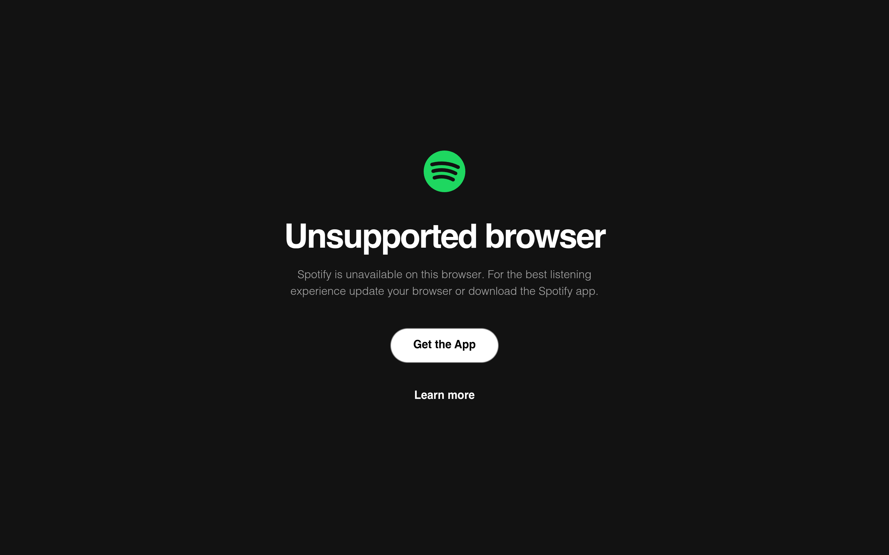
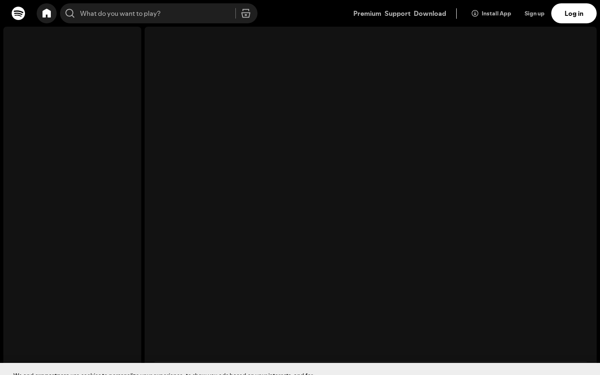
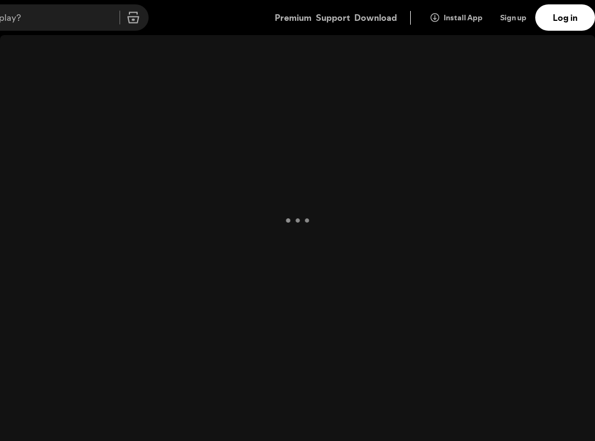
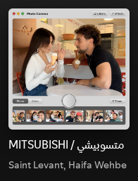
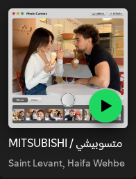
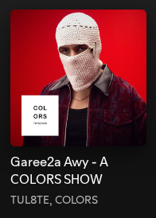
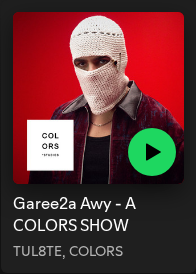

# spotify Design System

You are building UI for **spotify**. Light-themed, neutral palette, sans-serif typography (Times New Roman), standard density on a 5px grid.

## Visual Reference

**IMPORTANT**: Study ALL screenshots below before writing any UI. Match colors, typography, spacing, layout, and motion exactly as shown.

### Homepage



### Scroll Journey (Cinematic Visual States)

> These screenshots capture the website at different scroll depths. The design changes dramatically as you scroll — each frame shows a different cinematic state. Replicate these exact visual transitions.

#### 0% — Hero / Above the fold


#### 17% — Mid-page at 17% scroll


#### 33% — Mid-page at 33% scroll


#### 50% — Mid-page at 50% scroll


#### 67% — Mid-page at 67% scroll


#### 83% — Mid-page at 83% scroll


#### 100% — Footer / End of page


> Read `references/DESIGN.md` for full token details. Read `references/ANIMATIONS.md` for motion specs. Read `references/LAYOUT.md` for layout structure. Read `references/COMPONENTS.md` for component patterns.

## Ultra Reference Files

This package includes extended documentation. **Read these files before implementing:**

| File | Contents |
|------|----------|
| `references/DESIGN.md` | Full design system tokens, colors, typography, spacing |
| `references/VISUAL_GUIDE.md` | **START HERE** — Master visual guide with all screenshots embedded |
| `references/ANIMATIONS.md` | CSS keyframes, scroll triggers, motion library stack, video specs |
| `references/LAYOUT.md` | Flex/grid containers, page structure, spacing relationships |
| `references/COMPONENTS.md` | DOM component patterns, HTML structure, class fingerprints |
| `references/INTERACTIONS.md` | Hover/focus states with before/after style diffs |
| `screens/scroll/` | 7 scroll journey screenshots showing cinematic states |

### Animation Stack Detected

- **Web Animations API (4 active)** — animation

## Design Philosophy

- **Layered depth** — use shadow tokens to create a sense of physical layering. Each elevation level has a specific shadow.
- **Solid colors only** — no gradients anywhere. Every surface is a single flat color.
- **Type pairing** — Times New Roman for body/UI text, SpotifyMixUI for headings/display. Never introduce a third typeface.
- **standard density** — 5px base grid. Every dimension is a multiple of 5.
- **neutral palette** — the color temperature runs neutral, matching the sans-serif typography.
- **Minimal motion** — prefer instant state changes. Only use transitions for loading and page transitions.

## Color System

### Core Palette

| Role | Token | Hex | Use |
|------|-------|-----|-----|
| Background | `--background` | `#ffffff` | Page/app background |
| Surface | `--surface` | `#c1c1c1` | Cards, panels, modals |
| Text Primary | `--text-primary` | `#000000` | Headings, body text |
| Text Muted | `--text-muted` | `#b3b3b3` | Captions, placeholders |

### Extended Palette

- `#121212` — Deep background layer or shadow color

## Typography

### Font Stack

- **Times New Roman** — Heading 1, Heading 2, Heading 3
- **SpotifyMixUI** — Body, Caption

### Type Scale

| Role | Family | Size | Weight |
|------|--------|------|--------|
| Heading 1 | Times New Roman | 48px / 3rem | 700 |
| Heading 2 | Times New Roman | 32px / 2rem | 600 |
| Heading 3 | Times New Roman | 24px / 1.5rem | 600 |
| Body | SpotifyMixUI | 16px / 1rem | 400 |
| Caption | SpotifyMixUI | 12px / 0.75rem | 400 |

### Typography Rules

- Body/UI: **Times New Roman**, Headings: **SpotifyMixUI** — these are the only display fonts
- Max 3-4 font sizes per screen
- Headings: weight 600-700, body: weight 400
- Use color and opacity for text hierarchy, not additional font sizes
- Line height: 1.5 for body, 1.2 for headings

## Spacing & Layout

### Base Grid: 5px

Every dimension (margin, padding, gap, width, height) must be a multiple of **5px**.

### Spacing Scale

`5, 10, 15, 20, 25, 30, 35, 40, 45, 50, 55, 60` px

### Spacing as Meaning

| Spacing | Use |
|---------|-----|
| 2.5-5px | Tight: related items within a group |
| 10px | Medium: between groups |
| 15-20px | Wide: between sections |
| 30px+ | Vast: major section breaks |

### Border Radius

Scale: `2px`
Default: `2px`

## Component Patterns

### Card

```css
.card {
  background: #c1c1c1;
  border-radius: 2px;
  padding: 20px;
  box-shadow: rgb(128, 128, 128) 0px 0px 5px 0px;
}
```

```html
<div class="card">
  <h3>Card Title</h3>
  <p>Card content goes here.</p>
</div>
```

### Button

```css
/* Primary */
.btn-primary {
  background: #cccccc;
  color: #000000;
  border-radius: 2px;
  padding: 10px 20px;
  font-weight: 500;
  transition: opacity 150ms ease;
}
.btn-primary:hover { opacity: 0.9; }

/* Ghost */
.btn-ghost {
  background: transparent;
  border: 1px solid #cccccc;
  color: #000000;
  border-radius: 2px;
  padding: 10px 20px;
}
```

```html
<button class="btn-primary">Get Started</button>
<button class="btn-ghost">Learn More</button>
```

### Input

```css
.input {
  background: #ffffff;
  border: 1px solid #cccccc;
  border-radius: 2px;
  padding: 10px 15px;
  color: #000000;
  font-size: 14px;
}
.input:focus { border-color: var(--accent); outline: none; }
```

```html
<input class="input" type="text" placeholder="Search..." />
```

### Badge / Chip

```css
.badge {
  display: inline-flex;
  align-items: center;
  padding: 5px 10px;
  border-radius: 9999px;
  font-size: 12px;
  font-weight: 500;
  background: #c1c1c1;
  color: #b3b3b3;
}
```

```html
<span class="badge">New</span>
<span class="badge">Beta</span>
```

### Modal / Dialog

```css
.modal-backdrop { background: rgba(0, 0, 0, 0.6); }
.modal {
  background: #c1c1c1;
  border-radius: 2px;
  padding: 30px;
  max-width: 480px;
  width: 90vw;
  box-shadow: rgb(128, 128, 128) 0px 0px 5px 0px;
}
```

```html
<div class="modal-backdrop">
  <div class="modal">
    <h2>Dialog Title</h2>
    <p>Dialog content.</p>
    <button class="btn-primary">Confirm</button>
    <button class="btn-ghost">Cancel</button>
  </div>
</div>
```

### Table

```css
.table { width: 100%; border-collapse: collapse; }
.table th {
  text-align: left;
  padding: 10px 15px;
  font-weight: 500;
  font-size: 12px;
  color: #b3b3b3;
  text-transform: uppercase;
  letter-spacing: 0.05em;
  border-bottom: 1px solid #cccccc;
}
.table td {
  padding: 15px;
  border-bottom: 1px solid #cccccc;
}
```

```html
<table class="table">
  <thead><tr><th>Name</th><th>Status</th><th>Date</th></tr></thead>
  <tbody>
    <tr><td>Item One</td><td>Active</td><td>Jan 1</td></tr>
    <tr><td>Item Two</td><td>Pending</td><td>Jan 2</td></tr>
  </tbody>
</table>
```

### Navigation

```css
.nav {
  display: flex;
  align-items: center;
  gap: 10px;
  padding: 15px 20px;
}
.nav-link {
  color: #b3b3b3;
  padding: 10px 15px;
  border-radius: 2px;
  transition: color 150ms;
}
.nav-link:hover { color: #000000; }
```

```html
<nav class="nav">
  <a href="/" class="nav-link active">Home</a>
  <a href="/about" class="nav-link">About</a>
  <a href="/pricing" class="nav-link">Pricing</a>
  <button class="btn-primary" style="margin-left: auto">Get Started</button>
</nav>
```

## Animation & Motion

This project uses **subtle motion**. Transitions smooth state changes without calling attention.

### Motion Guidelines

- **Duration:** 150-300ms for micro-interactions, 300-500ms for page transitions
- **Easing:** `ease-out` for enters, `ease-in` for exits
- **Direction:** Elements enter from bottom/right, exit to top/left
- **Reduced motion:** Always respect `prefers-reduced-motion` — disable animations when set

## Depth & Elevation

### Shadow Tokens

- Raised (cards, buttons): `rgb(128, 128, 128) 0px 0px 5px 0px`

## Anti-Patterns (Never Do)

- **No gradients** — solid colors only, everywhere
- **No blur effects** — no backdrop-blur, no filter: blur()
- **No zebra striping** — tables and lists use borders for separation
- **No invented colors** — every hex value must come from the palette above
- **No arbitrary spacing** — every dimension is a multiple of 5px
- **No extra fonts** — only Times New Roman and SpotifyMixUI are allowed
- **No arbitrary border-radius** — use the scale: 2px
- **No opacity for disabled states** — use muted colors instead
- **No pill shapes** — this design doesn't use rounded-full / 9999px radius

## Workflow

1. **Read** `references/DESIGN.md` before writing any UI code
2. **Pick colors** from the Color System section — never invent new ones
3. **Set typography** — Times New Roman, SpotifyMixUI only, using the type scale
4. **Build layout** on the 5px grid — check every margin, padding, gap
5. **Match components** to patterns above before creating new ones
6. **Apply elevation** — use shadow tokens
7. **Validate** — every value traces back to a design token. No magic numbers.

## Brand Spec

- **Site URL:** `https://spotify.com`
- **Brand typeface:** Times New Roman

## Quick Reference

```
Background:     #ffffff
Surface:        #c1c1c1
Text:           #000000 / #b3b3b3
Accent:         (not extracted)
Border:         (not extracted)
Font:           Times New Roman
Spacing:        5px grid
Radius:         2px
Components:     0 detected
```

## When to Trigger

Activate this skill when:
- Creating new components, pages, or visual elements for spotify
- Writing CSS, Tailwind classes, styled-components, or inline styles
- Building page layouts, templates, or responsive designs
- Reviewing UI code for design consistency
- The user mentions "spotify" design, style, UI, or theme
- Generating mockups, wireframes, or visual prototypes

---

# Full Reference Files

> Every output file is embedded below. Claude has full design system context from /skills alone.

## Design System Tokens (DESIGN.md)

# spotify DESIGN.md

> Auto-generated design system — reverse-engineered via static analysis by skillui.
> Frameworks: None detected
> Colors: 5 · Fonts: 2 · Components: 0
> Icon library: not detected · State: not detected
> Primary theme: light · Dark mode toggle: no · Motion: none

## Visual Reference

**Match this design exactly** — study colors, fonts, spacing, and component shapes before writing any UI code.


---

## 1. Visual Theme & Atmosphere

This is a **light-themed** interface with a neutral, approachable feel. The light background emphasizes content clarity. Typography pairs **SpotifyMixUI** for display/headings with **Times New Roman** for body text, creating clear visual hierarchy through type contrast. Spacing follows a **5px base grid** (standard density), with scale: 5, 10, 15, 20, 25, 30, 35, 40px.

---

## 2. Color Palette & Roles

| Token | Hex | Role | Use |
|---|---|---|---|
| background | `#ffffff` | background | Page background, darkest surface |
| surface | `#c1c1c1` | surface | Card and panel backgrounds |
| text-primary | `#000000` | text-primary | Headings and body text |
| text-muted | `#b3b3b3` | text-muted | Captions, placeholders, secondary info |
| unknown | `#121212` | unknown | Palette color |


---

## 3. Typography Rules

**Font Stack:**
- **Times New Roman** — Heading 1, Heading 2, Heading 3
- **SpotifyMixUI** — Body, Caption

| Role | Font | Size | Weight |
|---|---|---|---|
| Heading 1 | Times New Roman | 48px / 3rem | 700 |
| Heading 2 | Times New Roman | 32px / 2rem | 600 |
| Heading 3 | Times New Roman | 24px / 1.5rem | 600 |
| Body | SpotifyMixUI | 16px / 1rem | 400 |
| Caption | SpotifyMixUI | 12px / 0.75rem | 400 |

**Typographic Rules:**
- Limit to 2 font families max per screen
- Use **Times New Roman** for body/UI text, **SpotifyMixUI** for display/headings
- Maintain consistent hierarchy: no more than 3-4 font sizes per screen
- Headings use bold (600-700), body uses regular (400)
- Line height: 1.5 for body text, 1.2 for headings
- Use color and opacity for secondary hierarchy, not additional font sizes


---

## 4. Component Stylings

No components detected. Scan `src/components/` or `components/` to populate this section.

---

## 5. Layout Principles

- **Base spacing unit:** 5px
- **Spacing scale:** 5, 10, 15, 20, 25, 30, 35, 40, 45, 50, 55, 60
- **Border radius:** 2px

**Spacing as Meaning:**
| Spacing | Use |
|---|---|
| 2.5-5px | Tight: related items within a group |
| 10px | Medium: between groups |
| 15-20px | Wide: between sections |
| 30px+ | Vast: major section breaks |


---

## 6. Depth & Elevation

### Raised — cards, buttons, interactive elements

- `rgb(128, 128, 128) 0px 0px 5px 0px`


---

## 8. Do's and Don'ts

### Do's

- Use `#ffffff` as the primary page background
- Pair **Times New Roman** (body) with **SpotifyMixUI** (display) — these are the only allowed fonts
- Follow the **5px** spacing grid for all margins, padding, and gaps
- Use the defined shadow tokens for elevation — see Section 6
- Use border-radius from the scale: 2px

### Don'ts

- Don't introduce colors outside this palette — extend the design tokens first
- Don't introduce additional font families beyond Times New Roman and SpotifyMixUI
- Don't use arbitrary spacing values — stick to multiples of 5px
- Don't create custom box-shadow values outside the system tokens
- Don't use gradients — the design uses solid colors only
- Don't use arbitrary border-radius values — pick from the defined scale
- Don't use backdrop-blur or blur effects

### Anti-Patterns (detected from codebase)

- No gradient backgrounds
- No blur or backdrop-blur effects
- No zebra striping on tables/lists


---

## 9. Responsive Behavior

No breakpoints detected. Consider adding responsive breakpoints to the design system.

---

## 10. Agent Prompt Guide

Use these as starting points when building new UI:

### Build a Card

```
Background: #c1c1c1
Border: 1px solid var(--border)
Radius: 2px
Padding: 20px
Font: Times New Roman
Use shadow tokens from Section 6.
```

### Build a Button

```
Primary: bg var(--accent), text white
Ghost: bg transparent, border var(--border)
Padding: 10px 20px
Radius: 2px
Hover: opacity 0.9 or lighter shade
Focus: ring with var(--accent)
```

### Build a Page Layout

```
Background: #ffffff
Max-width: 1280px, centered
Grid: 5px base
Responsive: mobile-first, breakpoints from Section 9
```

### Build a Stats Card

```
Surface: #c1c1c1
Label: #b3b3b3 (muted, 12px, uppercase)
Value: #000000 (primary, 24-32px, bold)
Status: use success/warning/danger from Section 2
```

### Build a Form

```
Input bg: #ffffff
Input border: 1px solid var(--border)
Focus: border-color var(--accent)
Label: #b3b3b3 12px
Spacing: 20px between fields
Radius: 2px
```

### General Component

```
1. Read DESIGN.md Sections 2-6 for tokens
2. Colors: only from palette
3. Font: Times New Roman, type scale from Section 3
4. Spacing: 5px grid
5. Components: match patterns from Section 4
6. Elevation: shadow tokens
```

## Visual Guide — Screenshots (VISUAL_GUIDE.md)

# spotify — Visual Guide

> Master visual reference. Study every screenshot carefully before implementing any UI.
> Match colors, layout, typography, spacing, and motion states exactly.

**Motion Stack:** **Web Animations API (4 active)**

## Scroll Journey

The page has cinematic scroll animations. Each screenshot below shows the exact visual state at that scroll depth.
**Replicate these transitions precisely** — the design changes dramatically as you scroll.

### Hero — Above the fold

*Scroll position: 0px of 900px total*


### 17% scroll depth

*Scroll position: 0px of 900px total*


### 33% scroll depth

*Scroll position: 0px of 900px total*


### 50% scroll depth

*Scroll position: 0px of 900px total*


### 67% scroll depth

*Scroll position: 0px of 900px total*


### 83% scroll depth

*Scroll position: 0px of 900px total*


### Footer — End of page

*Scroll position: 0px of 900px total*


## Full Page Screenshots

### Spotify – Web Player

*URL: `https://spotify.com`*


## Section Screenshots

Clipped sections showing individual components in context.

### Section 1 — `main > div`

*1085×804px*


## Animations & Motion (ANIMATIONS.md)

# Animation Reference

> Cinematic motion design extracted from live DOM. Follow these specs exactly to recreate the experience.

## Motion Technology Stack

| Library | Type | Notes |
|---------|------|-------|
| **Web Animations API (4 active)** | animation |  |

## Scroll Journey

The page is **900px** tall. Each frame below shows what the user sees at that scroll depth.

> **Use these screenshots to understand WHAT animates, WHEN it animates, and HOW it moves.**

### 0% — Top / Hero
Scroll position: 0px


### 17% — Opening Section
Scroll position: 0px


### 33% — First Feature Section
Scroll position: 0px


### 50% — Mid-Page
Scroll position: 0px


### 67% — Lower Content
Scroll position: 0px


### 83% — Near Footer
Scroll position: 0px


### 100% — Bottom / Footer
Scroll position: 0px


## Motion Tokens (CSS Variables)

### Duration Tokens

```css
--encore-productive-exit-duration: .2s;
```

### Animation Tokens

```css
--scrollAnimationRangeStart: 0px;
--scrollAnimationRangeEnd: 0px;
```

## Global Transition Declarations

These `transition` values were extracted from CSS rules across the site:

```css
transition: top 300ms, right 300ms, bottom 300ms, left 300ms, max-width 300ms;
transition: padding 300ms;
```

## How to Recreate This Motion Design

### Step 1 — Install Dependencies

```bash
```

### Step 2 — Scroll-Reveal Pattern

Elements that animate into view follow this pattern:

```css
/* Initial hidden state */
.reveal {
  opacity: 0;
  transform: translateY(40px);
  transition: opacity .2s cubic-bezier(0.4, 0, 0.2, 1),
              transform .2s cubic-bezier(0.4, 0, 0.2, 1);
}
.reveal.visible {
  opacity: 1;
  transform: translateY(0);
}
```

### Step 3 — Key Motion Principles

- **Duration scale:** `.2s` · `300ms` — use these values, never invent new durations
- **Always add** `@media (prefers-reduced-motion: reduce) { * { animation-duration: 0.01ms !important; transition-duration: 0.01ms !important; } }`

### Step 4 — Scroll Journey Reference

Match what happens at each scroll position:

- **0%** (`0px`) → `screens/scroll/scroll-000.png`
- **17%** (`0px`) → `screens/scroll/scroll-017.png`
- **33%** (`0px`) → `screens/scroll/scroll-033.png`
- **50%** (`0px`) → `screens/scroll/scroll-050.png`
- **67%** (`0px`) → `screens/scroll/scroll-067.png`
- **83%** (`0px`) → `screens/scroll/scroll-083.png`
- **100%** (`0px`) → `screens/scroll/scroll-100.png`

## Layout & Grid (LAYOUT.md)

# Layout Reference

> Auto-extracted from live DOM. Use this to understand how the site is structured spatially.

## Spacing System

**Base grid:** 5px

**Scale:** `5, 10, 15, 20, 25, 30, 35, 40, 45, 50, 55, 60, 65, 70, 75` px

| Spacing | Semantic Use |
|---------|-------------|
| 5px | Tight — within a component |
| 10px | Medium — between sibling items |
| 20px | Wide — between sections |
| 40px | Vast — major section breaks |

## Flex Layouts

| Element | Direction | Justify | Align | Gap | Children |
|---------|-----------|---------|-------|-----|----------|
| `nav.zOQ0BU6AULAqd7Qd` | column | — | — | 8px | 1 |
| `div.main-view-container__scroll-node.qLlzLghnvcCySJ8T` | row | — | stretch | — | 3 |
| `a.e-10451-legacy-button.e-10451-legacy-button-tertiary` | row | center | center | — | 2 |

## Structural Containers

### `<nav>` (`nav.zOQ0BU6AULAqd7Qd`)

```
display:          flex
flex-direction:   column
justify-content:  —
align-items:      —
gap:              8px
children:         1
```

### `<main>` (`main.J6wP3V0xzh0Hj_MS`)

```
display:          block
children:         2
```

## Layout Rules

- **Container max-width:** `100%` — always center with `margin: auto`
- Primary layout system: **Flexbox**
- Every spacing value must be a multiple of **5px**
- Never use arbitrary margin/padding values outside the spacing scale

## Component Patterns (COMPONENTS.md)

# Component Reference

> Repeated DOM patterns detected by structural analysis. Each component appeared 3+ times.

## Detected Components

| Component | Category | Instances | Key Classes |
|-----------|----------|-----------|-------------|
| **Mz1WXBbsL7QWP Ct** | unknown | 40× | `.mz1WXBbsL7QWP_Ct` |
| **LXxEtdyreLg2dh0C** | unknown | 40× | `.LXxEtdyreLg2dh0C` |
| **Card** | card | 40× | `.Card`, `.RPV24T758a0OhKtZ`, `.e-10451-box` |
| **E 10451 Card  Button** | card | 40× | `.e-10451-card__button`, `.e-10451-card__on-click` |
| **YR9YVGItxfIgAZje** | unknown | 40× | `.YR9YVGItxfIgAZje` |
| **E 10451 Button Tertiary  Condensed** | button | 3× | `.e-10451-button-tertiary--condensed`, `.e-10451-button-tertiary--medium`, `.e-10451-button-tertiary--text-subdued` |
| **E4IK04uNVRsB6jbO** | unknown | 3× | `.e4IK04uNVRsB6jbO`, `.l3tPikCftuELMOzz`, `.yTHNsGSMiG01kxo3` |
| **Va5STnBzPqkIqnaT** | unknown | 3× | `.va5STnBzPqkIqnaT` |
| **T9JaL14g0fwnpw83** | unknown | 3× | `.T9JaL14g0fwnpw83`, `.e-10451-box`, `.e-10451-box--min-size` |
| **E 10451 Legacy List Row  Header** | unknown | 3× | `.e-10451-legacy-list-row__header` |
| **E 10451 Legacy List Row  Column** | unknown | 3× | `.e-10451-legacy-list-row__column`, `.e-10451-legacy-list-row__interactive` |
| **E 10451 Legacy List Row Title** | unknown | 3× | `.e-10451-legacy-list-row-title`, `.e-10451-overflow-wrap-anywhere`, `.e-10451-text` |
| **E 10451 Line Clamp** | unknown | 3× | `.e-10451-line-clamp` |
| **E 10451 Legacy List Row  Interactive** | unknown | 3× | `.e-10451-legacy-list-row__interactive`, `.e-10451-legacy-list-row__slot` |
| **FOjXJqlCvEIMzJBF** | unknown | 3× | `.FOjXJqlCvEIMzJBF`, `.mbwNxmJkaTgwmZSP` |
| **E 10451 Text** | unknown | 3× | `.e-10451-text`, `.encore-internal-color-text-subdued`, `.encore-text-body-small-bold` |
| **CsidsUzBet0 Mp5i** | unknown | 3× | `.CsidsUzBet0_Mp5i`, `.MyaStf5D5Im3gt9M`, `.XtiGtrj_ysgd8Bmv` |
| **2WOtop0TLUrNXAd** | unknown | 3× | `._2WOtop0TLUrNXAd`, `.dxlv5wfAu8zgm7HY`, `.uvcTYGvrsVEujQSN` |
| **Uaz8OXg5s48bHAYm** | unknown | 3× | `.uaz8OXg5s48bHAYm` |
| **VTop8QvCkTYquxeI** | unknown | 3× | `.vTop8QvCkTYquxeI` |

## Cards

### Card

**Instances found:** 40

**CSS classes:** `.Card` `.RPV24T758a0OhKtZ` `.e-10451-box` `.e-10451-box--interactive` `.e-10451-box--naked` `.e-10451-box--padding-custom`

**HTML structure:**

```html
<div class="e-10451-box e-10451-box--naked e-10451-box--interactive e-10451-box--padding-custom e-10451-card RPV24T758a0OhKtZ Card" data-encore-id="card" role="listitem" aria-labelledby="card-title-spotify:track:5vKPXdlcP46Jaf8Q6X4haV-0" draggable="true" style="--box-padding: var(--encore-spacing-tighter); --encore-card-title-gap: var(--encore-spacing-tighter-4);"><div class="e-10451-card__on-click e-10451-card__button" role="button" aria-disabled="false" aria-labelledby="card-title-spotify:track:5vKPXdlcP46Jaf8Q6X4haV-0 card-subtitle-spotify:track:5vKPXdlcP46Jaf8Q6X4haV-0" aria-describedby="o
```

**Base styles (from design tokens):**

```css
.Card {
  background: #c1c1c1;
  border-radius: 2px;
  padding: 10px;
}```

### E 10451 Card  Button

**Instances found:** 40

**CSS classes:** `.e-10451-card__button` `.e-10451-card__on-click`

**HTML structure:**

```html
<div class="e-10451-card__on-click e-10451-card__button" role="button" aria-disabled="false" aria-labelledby="card-title-spotify:track:5vKPXdlcP46Jaf8Q6X4haV-0 card-subtitle-spotify:track:5vKPXdlcP46Jaf8Q6X4haV-0" aria-describedby="onClickHintspotify:track:5vKPXdlcP46Jaf8Q6X4haV-0" tabindex="0"></div>
```

**Base styles (from design tokens):**

```css
.e-10451-card__button {
  background: #c1c1c1;
  border-radius: 2px;
  padding: 10px;
}```

## Buttons

### E 10451 Button Tertiary  Condensed

**Instances found:** 3

**CSS classes:** `.e-10451-button-tertiary--condensed` `.e-10451-button-tertiary--medium` `.e-10451-button-tertiary--text-subdued` `.e-10451-legacy-button` `.e-10451-legacy-button--medium` `.e-10451-legacy-button-tertiary`

**HTML structure:**

```html
<button class="e-10451-legacy-button e-10451-legacy-button-tertiary e-10451-overflow-wrap-anywhere encore-text-body-medium-bold e-10451-legacy-button--medium e-10451-button-tertiary--medium e-10451-button-tertiary--condensed e-10451-button-tertiary--text-subdued encore-internal-color-text-subdued" data-encore-id="buttonTertiary">Premium</button>
```

**Base styles (from design tokens):**

```css
.e-10451-button-tertiary--condensed {
  color: #000000;
  border-radius: 2px;
  padding: 5px 10px;
  cursor: pointer;
}```

## Other Components

### Mz1WXBbsL7QWP Ct

**Instances found:** 40

**CSS classes:** `.mz1WXBbsL7QWP_Ct`

**HTML structure:**

```html
<div data-carousel-gridlist-item="true" class="mz1WXBbsL7QWP_Ct" data-rac="" tabindex="-1" data-collection="react-aria3604423509-:r2:" data-key="react-aria-1" id="react-aria3604423509-:r3:-react-aria-1" role="row"><div role="gridcell" aria-colindex="1" style="display: contents;"><div class="LXxEtdyreLg2dh0C" data-carousel-item="true" role="presentation"><div class="e-10451-box e-10451-box--naked e-10451-box--interactive e-10451-box--padding-custom e-10451-card RPV24T758a0OhKtZ Card" data-encore-id="card" role="listitem" aria-labelledby="card-title-spotify:track:5vKPXdlcP46Jaf8Q6X4haV-0" dragga
```

**Base styles (from design tokens):**

```css
.mz1WXBbsL7QWP_Ct {
  background: #c1c1c1;
  padding: 5px;
}```

### LXxEtdyreLg2dh0C

**Instances found:** 40

**CSS classes:** `.LXxEtdyreLg2dh0C`

**HTML structure:**

```html
<div class="LXxEtdyreLg2dh0C" data-carousel-item="true" role="presentation"><div class="e-10451-box e-10451-box--naked e-10451-box--interactive e-10451-box--padding-custom e-10451-card RPV24T758a0OhKtZ Card" data-encore-id="card" role="listitem" aria-labelledby="card-title-spotify:track:5vKPXdlcP46Jaf8Q6X4haV-0" draggable="true" style="--box-padding: var(--encore-spacing-tighter); --encore-card-title-gap: var(--encore-spacing-tighter-4);"><div class="e-10451-card__on-click e-10451-card__button" role="button" aria-disabled="false" aria-labelledby="card-title-spotify:track:5vKPXdlcP46Jaf8Q6X4haV
```

**Base styles (from design tokens):**

```css
.LXxEtdyreLg2dh0C {
  background: #c1c1c1;
  padding: 5px;
}```

### YR9YVGItxfIgAZje

**Instances found:** 40

**CSS classes:** `.YR9YVGItxfIgAZje`

**HTML structure:**

```html
<div class="YR9YVGItxfIgAZje"><div class="P0DCrcBH45YVGZwP" style="--card-color: #777777;"><div></div></div><div class="qpns1iHTAt8rMNnK"><div class="pk3lz3TYlskuAfwV" role="div"><button data-testid="play-button" aria-label="Play MITSUBISHI / متسوبيشي" data-encore-id="buttonPrimary" data-is-icon-only="true" class="e-10451-legacy-button-primary e-10451-legacy-button"><span class
```

**Base styles (from design tokens):**

```css
.YR9YVGItxfIgAZje {
  background: #c1c1c1;
  padding: 5px;
}```

### E4IK04uNVRsB6jbO

**Instances found:** 3

**CSS classes:** `.e4IK04uNVRsB6jbO` `.l3tPikCftuELMOzz` `.yTHNsGSMiG01kxo3`

**HTML structure:**

```html
<section class="l3tPikCftuELMOzz e4IK04uNVRsB6jbO yTHNsGSMiG01kxo3" data-shelf="carousel" data-testid="component-shelf" aria-label="Trending songs"><div class="va5STnBzPqkIqnaT"><div class="e-10451-box e-10451-box--naked e-10451-box--padding-inline-start-custom e-10451-box--padding-inline-end-custom e-10451-box--padding-block-start-custom e-10451-box--padding-block-end-custom e-10451-box--min-size e-10451-legacy-list-row T9JaL14g0fwnpw83" data-encore-id="listRow" role="group" aria-labelledby="listrow-title-:r1:" data-testid="rich-title-row-shelf-header" style="--box-padding-block-start: var(--
```

**Base styles (from design tokens):**

```css
.e4IK04uNVRsB6jbO {
  background: #c1c1c1;
  padding: 5px;
}```

### Va5STnBzPqkIqnaT

**Instances found:** 3

**CSS classes:** `.va5STnBzPqkIqnaT`

**HTML structure:**

```html
<div class="va5STnBzPqkIqnaT"><div class="e-10451-box e-10451-box--naked e-10451-box--padding-inline-start-custom e-10451-box--padding-inline-end-custom e-10451-box--padding-block-start-custom e-10451-box--padding-block-end-custom e-10451-box--min-size e-10451-legacy-list-row T9JaL14g0fwnpw83" data-encore-id="listRow" role="group" aria-labelledby="listrow-title-:r1:" data-testid="rich-title-row-shelf-header" style="--box-padding-block-start: var(--encore-spacing-tighter-2); --box-padding-block-end: var(--encore-spacing-tighter-2); --box-padding-inline-start: none; --box-padding-inline-end: non
```

**Base styles (from design tokens):**

```css
.va5STnBzPqkIqnaT {
  background: #c1c1c1;
  padding: 5px;
}```

### T9JaL14g0fwnpw83

**Instances found:** 3

**CSS classes:** `.T9JaL14g0fwnpw83` `.e-10451-box` `.e-10451-box--min-size` `.e-10451-box--naked` `.e-10451-box--padding-block-end-custom` `.e-10451-box--padding-block-start-custom`

**HTML structure:**

```html
<div class="e-10451-box e-10451-box--naked e-10451-box--padding-inline-start-custom e-10451-box--padding-inline-end-custom e-10451-box--padding-block-start-custom e-10451-box--padding-block-end-custom e-10451-box--min-size e-10451-legacy-list-row T9JaL14g0fwnpw83" data-encore-id="listRow" role="group" aria-labelledby="listrow-title-:r1:" data-testid="rich-title-row-shelf-header" style="--box-padding-block-start: var(--encore-spacing-tighter-2); --box-padding-block-end: var(--encore-spacing-tighter-2); --box-padding-inline-start: none; --box-padding-inline-end: none; --box-min-block-size: var(-
```

**Base styles (from design tokens):**

```css
.T9JaL14g0fwnpw83 {
  background: #c1c1c1;
  padding: 5px;
}```

### E 10451 Legacy List Row  Header

**Instances found:** 3

**CSS classes:** `.e-10451-legacy-list-row__header`

**HTML structure:**

```html
<div class="e-10451-legacy-list-row__header"><div class="e-10451-legacy-list-row__column e-10451-legacy-list-row__interactive"><h2 class="e-10451-text encore-text-title-small encore-internal-color-text-base e-10451-legacy-list-row-title e-10451-overflow-wrap-anywhere nA1_dDjmaSsSS5B2" data-encore-id="listRowTitle" id=":r1:" aria-describedby=":r0:" aria-hidden="true"><span class="e-10451-line-clamp" style="--encore-line-clamp: 1;"><a draggable="false" data-testid="see-all-link" tabindex="-1" href="/section/0JQ5DB5E8N831KzFzsBBQ2">Trending songs</a></span></h2></div><div class="e-10451-legacy-li
```

**Base styles (from design tokens):**

```css
.e-10451-legacy-list-row__header {
  background: #c1c1c1;
  padding: 5px;
}```

### E 10451 Legacy List Row  Column

**Instances found:** 3

**CSS classes:** `.e-10451-legacy-list-row__column` `.e-10451-legacy-list-row__interactive`

**HTML structure:**

```html
<div class="e-10451-legacy-list-row__column e-10451-legacy-list-row__interactive"><h2 class="e-10451-text encore-text-title-small encore-internal-color-text-base e-10451-legacy-list-row-title e-10451-overflow-wrap-anywhere nA1_dDjmaSsSS5B2" data-encore-id="listRowTitle" id=":r1:" aria-describedby=":r0:" aria-hidden="true"><span class="e-10451-line-clamp" style="--encore-line-clamp: 1;"><a draggable="false" data-testid="see-all-link" tabindex="-1" href="/section/0JQ5DB5E8N831KzFzsBBQ2">Trending songs</a></span></h2></div>
```

**Base styles (from design tokens):**

```css
.e-10451-legacy-list-row__column {
  background: #c1c1c1;
  padding: 5px;
}```

### E 10451 Legacy List Row Title

**Instances found:** 3

**CSS classes:** `.e-10451-legacy-list-row-title` `.e-10451-overflow-wrap-anywhere` `.e-10451-text` `.encore-internal-color-text-base` `.encore-text-title-small` `.nA1_dDjmaSsSS5B2`

**HTML structure:**

```html
<h2 class="e-10451-text encore-text-title-small encore-internal-color-text-base e-10451-legacy-list-row-title e-10451-overflow-wrap-anywhere nA1_dDjmaSsSS5B2" data-encore-id="listRowTitle" id=":r1:" aria-describedby=":r0:" aria-hidden="true"><span class="e-10451-line-clamp" style="--encore-line-clamp: 1;"><a draggable="false" data-testid="see-all-link" tabindex="-1" href="/section/0JQ5DB5E8N831KzFzsBBQ2">Trending songs</a></span></h2>
```

**Base styles (from design tokens):**

```css
.e-10451-legacy-list-row-title {
  background: #c1c1c1;
  padding: 5px;
}```

### E 10451 Line Clamp

**Instances found:** 3

**CSS classes:** `.e-10451-line-clamp`

**HTML structure:**

```html
<span class="e-10451-line-clamp" style="--encore-line-clamp: 1;"><a draggable="false" data-testid="see-all-link" tabindex="-1" href="/section/0JQ5DB5E8N831KzFzsBBQ2">Trending songs</a></span>
```

**Base styles (from design tokens):**

```css
.e-10451-line-clamp {
  background: #c1c1c1;
  padding: 5px;
}```

### E 10451 Legacy List Row  Interactive

**Instances found:** 3

**CSS classes:** `.e-10451-legacy-list-row__interactive` `.e-10451-legacy-list-row__slot`

**HTML structure:**

```html
<div class="e-10451-legacy-list-row__slot e-10451-legacy-list-row__interactive"><a draggable="false" class="FOjXJqlCvEIMzJBF mbwNxmJkaTgwmZSP" href="/section/0JQ5DB5E8N831KzFzsBBQ2"><span class="e-10451-text encore-text-body-small-bold encore-internal-color-text-subdued" data-encore-id="text">Show all</span></a></div>
```

**Base styles (from design tokens):**

```css
.e-10451-legacy-list-row__interactive {
  background: #c1c1c1;
  padding: 5px;
}```

### FOjXJqlCvEIMzJBF

**Instances found:** 3

**CSS classes:** `.FOjXJqlCvEIMzJBF` `.mbwNxmJkaTgwmZSP`

**HTML structure:**

```html
<a draggable="false" class="FOjXJqlCvEIMzJBF mbwNxmJkaTgwmZSP" href="/section/0JQ5DB5E8N831KzFzsBBQ2"><span class="e-10451-text encore-text-body-small-bold encore-internal-color-text-subdued" data-encore-id="text">Show all</span></a>
```

**Base styles (from design tokens):**

```css
.FOjXJqlCvEIMzJBF {
  background: #c1c1c1;
  padding: 5px;
}```

### E 10451 Text

**Instances found:** 3

**CSS classes:** `.e-10451-text` `.encore-internal-color-text-subdued` `.encore-text-body-small-bold`

**HTML structure:**

```html
<span class="e-10451-text encore-text-body-small-bold encore-internal-color-text-subdued" data-encore-id="text">Show all</span>
```

**Base styles (from design tokens):**

```css
.e-10451-text {
  background: #c1c1c1;
  padding: 5px;
}```

### CsidsUzBet0 Mp5i

**Instances found:** 3

**CSS classes:** `.CsidsUzBet0_Mp5i` `.MyaStf5D5Im3gt9M` `.XtiGtrj_ysgd8Bmv`

**HTML structure:**

```html
<div class="MyaStf5D5Im3gt9M XtiGtrj_ysgd8Bmv CsidsUzBet0_Mp5i" style="--scrollAnimationRangeStart: 10px; --scrollAnimationRangeEnd: 60px;"><div class="dxlv5wfAu8zgm7HY uvcTYGvrsVEujQSN _2WOtop0TLUrNXAd" role="presentation" data-testid="carousel-scroller" style="scroll-padding: 0px var(--margin, 0px);"><div role="presentation" class="uaz8OXg5s48bHAYm"><template data-react-aria-hidden="true"></template><span data-focus-scope-start="true" hidden=""></span><div class="vTop8QvCkTYquxeI" data-rac="" aria-label="Trending songs" role="grid" id="react-aria3604423509-:r3:" tabindex="0" data-layout="sta
```

**Base styles (from design tokens):**

```css
.CsidsUzBet0_Mp5i {
  background: #c1c1c1;
  padding: 5px;
}```

### 2WOtop0TLUrNXAd

**Instances found:** 3

**CSS classes:** `._2WOtop0TLUrNXAd` `.dxlv5wfAu8zgm7HY` `.uvcTYGvrsVEujQSN`

**HTML structure:**

```html
<div class="dxlv5wfAu8zgm7HY uvcTYGvrsVEujQSN _2WOtop0TLUrNXAd" role="presentation" data-testid="carousel-scroller" style="scroll-padding: 0px var(--margin, 0px);"><div role="presentation" class="uaz8OXg5s48bHAYm"><template data-react-aria-hidden="true"></template><span data-focus-scope-start="true" hidden=""></span><div class="vTop8QvCkTYquxeI" data-rac="" aria-label="Trending songs" role="grid" id="react-aria3604423509-:r3:" tabindex="0" data-layout="stack" data-collection="react-aria3604423509-:r2:"><div data-carousel-gridlist-item="true" class="mz1WXBbsL7QWP_Ct" data-rac="" tabindex="-1" d
```

**Base styles (from design tokens):**

```css
._2WOtop0TLUrNXAd {
  background: #c1c1c1;
  padding: 5px;
}```

### Uaz8OXg5s48bHAYm

**Instances found:** 3

**CSS classes:** `.uaz8OXg5s48bHAYm`

**HTML structure:**

```html
<div role="presentation" class="uaz8OXg5s48bHAYm"><template data-react-aria-hidden="true"></template><span data-focus-scope-start="true" hidden=""></span><div class="vTop8QvCkTYquxeI" data-rac="" aria-label="Trending songs" role="grid" id="react-aria3604423509-:r3:" tabindex="0" data-layout="stack" data-collection="react-aria3604423509-:r2:"><div data-carousel-gridlist-item="true" class="mz1WXBbsL7QWP_Ct" data-rac="" tabindex="-1" data-collection="react-aria3604423509-:r2:" data-key="react-aria-1" id="react-aria3604423509-:r3:-react-aria-1" role="row"><div role="gridcell" aria-colindex="1" sty
```

**Base styles (from design tokens):**

```css
.uaz8OXg5s48bHAYm {
  background: #c1c1c1;
  padding: 5px;
}```

### VTop8QvCkTYquxeI

**Instances found:** 3

**CSS classes:** `.vTop8QvCkTYquxeI`

**HTML structure:**

```html
<div class="vTop8QvCkTYquxeI" data-rac="" aria-label="Trending songs" role="grid" id="react-aria3604423509-:r3:" tabindex="0" data-layout="stack" data-collection="react-aria3604423509-:r2:"><div data-carousel-gridlist-item="true" class="mz1WXBbsL7QWP_Ct" data-rac="" tabindex="-1" data-collection="react-aria3604423509-:r2:" data-key="react-aria-1" id="react-aria3604423509-:r3:-react-aria-1" role="row"><div role="gridcell" aria-colindex="1" style="display: contents;"><div class="LXxEtdyreLg2dh0C" data-carousel-item="true" role="presentation"><div class="e-10451-box e-10451-box--naked e-10451-box
```

**Base styles (from design tokens):**

```css
.vTop8QvCkTYquxeI {
  background: #c1c1c1;
  padding: 5px;
}```

## Component Rules

- Match class names exactly from the patterns above
- Each component instance must be visually identical to others of its type
- Do not add extra wrappers or change the DOM structure

## Interactions & States (INTERACTIONS.md)

# Interaction Reference

> Micro-interactions extracted from live DOM. Recreate these exactly for authentic feel.

## Coverage

| Component Type | Count | States Captured |
|----------------|-------|----------------|
| Button | 3 | default, hover, focus |
| Role Button | 3 | default, hover, focus |
| Link | 3 | default, hover, focus |
| Input | 3 | default, hover, focus |

## Transition System

These transition declarations were extracted from interactive elements:

```css
transition: background-color 0.2s ease-in-out, color 0.2s ease-in-out;
transition: color 0.22s ease-in;
transition: color 0.15s cubic-bezier(0.3, 0, 0, 1), transform 0.15s cubic-bezier(0.3, 0, 0, 1);
transition: all;
transition: background-color 0.15s cubic-bezier(0.3, 0, 0, 1), transform 0.15s cubic-bezier(0.3, 0, 0, 1);
transition: box-shadow 0.22s ease-in, background 0.22s ease-in, color 0.22s ease-in;
```

Apply these to all interactive elements. Never invent new durations or easings.

## Button Interactions

### Button 1 — `Home`

**States:**

- Default: `../screens/states/button-1-default.png`
- Hover: `../screens/states/button-1-hover.png`
- Focus: `../screens/states/button-1-focus.png`

**On hover:**

```css
/* background-color: rgb(31, 31, 31) → */ background-color: rgb(42, 42, 42);
/* transform: none → */ transform: matrix(1.04, 0, 0, 1.04, 0, 0);
```

**Transition:** `background-color 0.2s ease-in-out, color 0.2s ease-in-out`

### Button 2 — `Search`

**States:**

- Default: `../screens/states/button-2-default.png`
- Hover: `../screens/states/button-2-hover.png`
- Focus: `../screens/states/button-2-focus.png`

**On hover:**

```css
/* color: rgb(179, 179, 179) → */ color: rgb(255, 255, 255);
/* border-color: rgb(179, 179, 179) → */ border-color: rgb(255, 255, 255);
/* transform: none → */ transform: matrix(1.04, 0, 0, 1.04, 0, 0);
/* outline: rgb(179, 179, 179) none 3px → */ outline: rgb(255, 255, 255) none 3px;
/* outline-color: rgb(179, 179, 179) → */ outline-color: rgb(255, 255, 255);
```

**On focus:**

```css
/* color: rgb(179, 179, 179) → */ color: rgb(255, 255, 255);
/* border-color: rgb(179, 179, 179) → */ border-color: rgb(255, 255, 255);
/* outline: rgb(179, 179, 179) none 3px → */ outline: rgb(255, 255, 255) none 3px;
/* outline-color: rgb(179, 179, 179) → */ outline-color: rgb(255, 255, 255);
```

**Transition:** `color 0.22s ease-in`

### Button 3 — `Browse`

**States:**

- Default: `../screens/states/button-3-default.png`
- Hover: `../screens/states/button-3-hover.png`
- Focus: `../screens/states/button-3-focus.png`

**On hover:**

```css
/* color: rgb(179, 179, 179) → */ color: rgb(255, 255, 255);
/* border-color: rgb(179, 179, 179) → */ border-color: rgb(255, 255, 255);
/* transform: none → */ transform: matrix(1.04, 0, 0, 1.04, 0, 0);
/* outline: rgb(179, 179, 179) none 3px → */ outline: rgb(255, 255, 255) none 3px;
/* outline-color: rgb(179, 179, 179) → */ outline-color: rgb(255, 255, 255);
/* transition: color 0.15s cubic-bezier(0.3, 0, 0, 1), transform 0.15s cubic-bezier(0.3, 0, 0, 1) → */ transition: color 0.05s cubic-bezier(0.3, 0, 0, 1), transform 0.05s cubic-bezier(0.3, 0, 0, 1);
```

**Transition:** `color 0.15s cubic-bezier(0.3, 0, 0, 1), transform 0.15s cubic-bezier(0.3, 0, 0, 1)`

## Role Button Interactions

### Role Button 1 — `div`

**States:**

- Default: `../screens/states/role-button-1-default.png`
- Hover: `../screens/states/role-button-1-hover.png`
- Focus: `../screens/states/role-button-1-focus.png`

**Transition:** `all`

_No visible style changes detected for this element._

### Role Button 2 — `div`

**States:**

- Default: `../screens/states/role-button-2-default.png`
- Hover: `../screens/states/role-button-2-hover.png`
- Focus: `../screens/states/role-button-2-focus.png`

**Transition:** `all`

_No visible style changes detected for this element._

### Role Button 3 — `div`

**States:**

- Default: `../screens/states/role-button-3-default.png`
- Hover: `../screens/states/role-button-3-hover.png`
- Focus: `../screens/states/role-button-3-focus.png`

**Transition:** `all`

_No visible style changes detected for this element._

## Link Interactions

### Link 1 — `a`

**States:**

- Default: `../screens/states/link-1-default.png`
- Hover: `../screens/states/link-1-hover.png`
- Focus: `../screens/states/link-1-focus.png`

**On hover:**

```css
/* text-decoration: none → */ text-decoration: underline;
```

**On focus:**

```css
/* text-decoration: none → */ text-decoration: underline;
```

**Transition:** `all`

### Link 2 — `Install App`

**States:**

- Default: `../screens/states/link-2-default.png`
- Hover: `../screens/states/link-2-hover.png`
- Focus: `../screens/states/link-2-focus.png`

**On hover:**

```css
/* color: rgb(179, 179, 179) → */ color: rgb(255, 255, 255);
/* border-color: rgb(179, 179, 179) → */ border-color: rgb(255, 255, 255);
/* transform: none → */ transform: matrix(1.04, 0, 0, 1.04, 0, 0);
/* outline: rgb(179, 179, 179) none 3px → */ outline: rgb(255, 255, 255) none 3px;
/* outline-color: rgb(179, 179, 179) → */ outline-color: rgb(255, 255, 255);
/* transition: color 0.15s cubic-bezier(0.3, 0, 0, 1), transform 0.15s cubic-bezier(0.3, 0, 0, 1) → */ transition: color 0.05s cubic-bezier(0.3, 0, 0, 1), transform 0.05s cubic-bezier(0.3, 0, 0, 1);
```

**Transition:** `color 0.15s cubic-bezier(0.3, 0, 0, 1), transform 0.15s cubic-bezier(0.3, 0, 0, 1)`

### Link 3 — `Browse podcasts`

**States:**

- Default: `../screens/states/link-3-default.png`
- Hover: `../screens/states/link-3-hover.png`
- Focus: `../screens/states/link-3-focus.png`

**On hover:**

```css
/* transform: none → */ transform: matrix(1.04, 0, 0, 1.04, 0, 0);
/* transition: background-color 0.15s cubic-bezier(0.3, 0, 0, 1), transform 0.15s cubic-bezier(0.3, 0, 0, 1) → */ transition: background-color 0.05s cubic-bezier(0.3, 0, 0, 1), transform 0.05s cubic-bezier(0.3, 0, 0, 1);
```

**Transition:** `background-color 0.15s cubic-bezier(0.3, 0, 0, 1), transform 0.15s cubic-bezier(0.3, 0, 0, 1)`

## Input Interactions

### Input 1 — `What do you want to play?`

**States:**

- Default: `../screens/states/input-1-default.png`
- Hover: `../screens/states/input-1-hover.png`
- Focus: `../screens/states/input-1-focus.png`

**On hover:**

```css
/* background-color: rgb(31, 31, 31) → */ background-color: rgb(42, 42, 42);
/* box-shadow: none → */ box-shadow: rgba(255, 255, 255, 0.1) 0px 0px 0px 1px inset;
```

**On focus:**

```css
/* background-color: rgb(31, 31, 31) → */ background-color: rgb(42, 42, 42);
/* box-shadow: none → */ box-shadow: rgb(255, 255, 255) 0px 0px 0px 2px inset;
```

**Transition:** `box-shadow 0.22s ease-in, background 0.22s ease-in, color 0.22s ease-in`

### Input 2 — `range`

**States:**

- Default: `../screens/states/input-2-default.png`
- Hover: `../screens/states/input-2-hover.png`
- Focus: `../screens/states/input-2-focus.png`

**Transition:** `all`

_No visible style changes detected for this element._

### Input 3 — `range`

**States:**

- Default: `../screens/states/input-3-default.png`
- Hover: `../screens/states/input-3-hover.png`
- Focus: `../screens/states/input-3-focus.png`

**Transition:** `all`

_No visible style changes detected for this element._

## Interaction Rules

- Hover effects include **color transitions** — use the extracted values, not approximations
- Focus states use **outline** (not box-shadow) — always match the extracted focus ring
- Transition durations in use: `0.2s`, `0.22s`, `0.15s`
- Always respect `prefers-reduced-motion` — set all transitions to `0s` when enabled

## Design Tokens — JSON Files

### tokens/colors.json
```json
{
  "$schema": "https://design-tokens.github.io/community-group/format/",
  "core": {
    "text-muted": {
      "value": "#b3b3b3",
      "role": "text-muted"
    },
    "text-primary": {
      "value": "#000000",
      "role": "text-primary"
    },
    "background": {
      "value": "#ffffff",
      "role": "background"
    },
    "surface": {
      "value": "#c1c1c1",
      "role": "surface"
    }
  },
  "status": {},
  "extended": {
    "color-121212": {
      "value": "#121212",
      "role": "unknown"
    }
  },
  "meta": {
    "theme": "light",
    "extracted": "2026-07-15"
  }
}
```

### tokens/spacing.json
```json
{
  "base": {
    "value": "5px",
    "description": "Grid unit — all spacing must be multiples of this"
  },
  "unit": "px",
  "scale": {
    "xs": {
      "value": "5px",
      "px": 5
    },
    "sm": {
      "value": "10px",
      "px": 10
    },
    "md": {
      "value": "15px",
      "px": 15
    },
    "lg": {
      "value": "20px",
      "px": 20
    },
    "xl": {
      "value": "25px",
      "px": 25
    },
    "2xl": {
      "value": "30px",
      "px": 30
    },
    "3xl": {
      "value": "35px",
      "px": 35
    },
    "4xl": {
      "value": "40px",
      "px": 40
    },
    "5xl": {
      "value": "45px",
      "px": 45
    },
    "6xl": {
      "value": "50px",
      "px": 50
    }
  },
  "multipliers": {
    "1x": {
      "value": "5px",
      "raw": 5
    },
    "2x": {
      "value": "10px",
      "raw": 10
    },
    "3x": {
      "value": "15px",
      "raw": 15
    },
    "4x": {
      "value": "20px",
      "raw": 20
    },
    "5x": {
      "value": "25px",
      "raw": 25
    },
    "6x": {
      "value": "30px",
      "raw": 30
    },
    "7x": {
      "value": "35px",
      "raw": 35
    },
    "8x": {
      "value": "40px",
      "raw": 40
    },
    "9x": {
      "value": "45px",
      "raw": 45
    },
    "10x": {
      "value": "50px",
      "raw": 50
    },
    "11x": {
      "value": "55px",
      "raw": 55
    },
    "12x": {
      "value": "60px",
      "raw": 60
    },
    "13x": {
      "value": "65px",
      "raw": 65
    },
    "14x": {
      "value": "70px",
      "raw": 70
    },
    "15x": {
      "value": "75px",
      "raw": 75
    },
    "16x": {
      "value": "80px",
      "raw": 80
    }
  },
  "meta": {
    "totalValues": 15,
    "min": 5,
    "max": 75
  }
}
```

### tokens/typography.json
```json
{
  "families": [
    "Times New Roman",
    "SpotifyMixUI"
  ],
  "scale": {
    "heading-1": {
      "fontFamily": "Times New Roman",
      "fontSize": "48px / 3rem",
      "fontWeight": "700",
      "lineHeight": null,
      "source": "computed"
    },
    "heading-2": {
      "fontFamily": "Times New Roman",
      "fontSize": "32px / 2rem",
      "fontWeight": "600",
      "lineHeight": null,
      "source": "computed"
    },
    "heading-3": {
      "fontFamily": "Times New Roman",
      "fontSize": "24px / 1.5rem",
      "fontWeight": "600",
      "lineHeight": null,
      "source": "computed"
    },
    "body": {
      "fontFamily": "SpotifyMixUI",
      "fontSize": "16px / 1rem",
      "fontWeight": "400",
      "lineHeight": null,
      "source": "computed"
    },
    "caption": {
      "fontFamily": "SpotifyMixUI",
      "fontSize": "12px / 0.75rem",
      "fontWeight": "400",
      "lineHeight": null,
      "source": "computed"
    }
  },
  "fontFaces": [],
  "rules": {
    "maxSizesPerScreen": 4,
    "headingWeightRange": "600-700",
    "bodyWeight": 400,
    "lineHeightBody": 1.5,
    "lineHeightHeading": 1.2
  }
}
```

## Bundled Fonts (fonts/)

The following font files are bundled in the `fonts/` directory:

- `fonts/CircularSp-Arab-700.woff`
- `fonts/CircularSp-Arab-700.woff2`
- `fonts/CircularSp-Arab-800.woff`
- `fonts/CircularSp-Arab-800.woff2`
- `fonts/CircularSp-Arab-Regular.woff`
- `fonts/CircularSp-Arab-Regular.woff2`
- `fonts/CircularSp-Cyrl-700.woff`
- `fonts/CircularSp-Cyrl-700.woff2`
- `fonts/CircularSp-Cyrl-800.woff`
- `fonts/CircularSp-Cyrl-800.woff2`
- `fonts/CircularSp-Cyrl-Regular.woff`
- `fonts/CircularSp-Cyrl-Regular.woff2`
- `fonts/CircularSp-Deva-700.woff`
- `fonts/CircularSp-Deva-700.woff2`
- `fonts/CircularSp-Deva-800.woff`
- `fonts/CircularSp-Deva-800.woff2`
- `fonts/CircularSp-Deva-Regular.woff`
- `fonts/CircularSp-Deva-Regular.woff2`
- `fonts/CircularSp-Grek-700.woff`
- `fonts/CircularSp-Grek-700.woff2`
- `fonts/CircularSp-Grek-800.woff`
- `fonts/CircularSp-Grek-800.woff2`
- `fonts/CircularSp-Grek-Regular.woff`
- `fonts/CircularSp-Grek-Regular.woff2`
- `fonts/CircularSp-Hebr-700.woff`
- `fonts/CircularSp-Hebr-700.woff2`
- `fonts/CircularSp-Hebr-800.woff`
- `fonts/CircularSp-Hebr-800.woff2`
- `fonts/CircularSp-Hebr-Regular.woff`
- `fonts/CircularSp-Hebr-Regular.woff2`
- `fonts/SpotifyMixMono-Regular.woff`
- `fonts/SpotifyMixMono-Regular.woff2`
- `fonts/SpotifyMixUI-700.woff`
- `fonts/SpotifyMixUI-700.woff2`
- `fonts/SpotifyMixUI-Regular.woff`
- `fonts/SpotifyMixUI-Regular.woff2`
- `fonts/SpotifyMixUITitle-700.woff`
- `fonts/SpotifyMixUITitle-700.woff2`
- `fonts/SpotifyMixUITitle-800.woff`
- `fonts/SpotifyMixUITitle-800.woff2`
- `fonts/SpotifyMixUITitleVariable-100.woff`
- `fonts/SpotifyMixUITitleVariable-100.woff2`

Use these local font files in `@font-face` declarations instead of fetching from Google Fonts.

## Screenshots Inventory (screens/)

> Study all screenshots carefully before implementing any UI. Match every visual detail exactly.

### Scroll Journey (screens/scroll/)

*Cinematic scroll states — page visual at each scroll depth*


### Full Page Screenshots (screens/pages/)

*Full-page screenshots of each crawled URL*



### Section Clips (screens/sections/)

*Clipped individual sections and components*



### Interaction States (screens/states/)

*Hover, focus, and active state captures*













### Screenshot Index (screens/INDEX.md)

# Screenshot Index

## Scroll Journey

> Shows the cinematic state at each point of the page

| Scroll | Y Position | File |
|--------|-----------|------|
| 0% | 0px | `screens/scroll/scroll-000.png` |
| 17% | 0px | `screens/scroll/scroll-017.png` |
| 33% | 0px | `screens/scroll/scroll-033.png` |
| 50% | 0px | `screens/scroll/scroll-050.png` |
| 67% | 0px | `screens/scroll/scroll-067.png` |
| 83% | 0px | `screens/scroll/scroll-083.png` |
| 100% | 0px | `screens/scroll/scroll-100.png` |

## Pages

| Page | URL | File |
|------|-----|------|
| Spotify – Web Player | `https://spotify.com` | `screens/pages/home.png` |

## Sections

| Page | Section | File |
|------|---------|------|
| home | #1 (main > div) | `screens/sections/home-section-1.png` |

## Homepage Screenshots (screenshots/)


